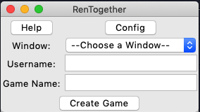

# RenTogether

Submitted to HTN++ 2021.

RenTogether is a tool that allows for a more interactive way for game hosts to play with their audience. It allows for the audience to really allow their opinion to shine in a cool and user friendly way. This Guide will explain how to setup RenTogether on your device!

# Installation

Installation is really simple. You need to have working installation of python3 (>= 3.6) and a working installation of pip. Then just run pip install to download the latest version of RenTogether

```bash
pip install RenTogether
```

# Execution

Running RenTogether is also amazingly simple. Just run:

```bash
# Windows
python3 -m rentogether
# Mac OS X [You need Admin Perms]
sudo python3 -m rentogether
```

And it should run the application for you. You will see a window pop up that looks something like this:



# Usage

Using the application might require a little bit of studying, but it'll all be worth it. The application interface for the viewer is much simpler. They can open the link https://bit.ly/RenTogether to open the user interface.

## Before the Game

As the host you first need to choose the game window. **Make sure the game is open before you run RenTogether!** If you forgot, then you just need to close and run it again. Choose your window from the dropdown list in the GUI. 

You will also need to choose a username (doesn't have to be unique) and a game name. Fill them out before you start.

Once all the information has been filled, you can proceed to click `Create Game`. This will generate a code at the bottom of the GUI. Provide this to your audience as they will be using it to login to the web interface.

## Throughout the Game

As your game progresses, whenever you feel as if there should be user input on some situation (Example: Choices in a Visual Novel), you can press the event hotkey (default: F10). This will trigger an event reading sequence.

While this sequence is active simply hover over any option on the screen and press the click hotkey (default: F9). This will save the coordinates of your mouse and be used to make the polling UI for the audience.

Once you have recorded all your options, press the submit hotkey (default: F8) to submit these options to the server. All viewers will then be given the choices and can select whichever ones they please.

## After the Game

Once you have completed your session, you can either hit the quit hotkey (default: F6) or the close the quiz button to stop the game. This will disconnect all viewers and close the session. From there you can just close the rentogether gui window to fully close it.

# Configuration

There will be a `Config` button located on the top right corner. Opening this will allow you to configure the hotkeys mentioned previously.

Please use all lowercase while typing in the hotkeys, and ensure that all keys are seperated **only** by a "+".

# F.A.Q
~~more like questions I asked myself once~~

## Who is this for?
Anyone who wants to add a twist to how they interact with their computer.

## Why does this exist?
I thought it'd be a fun project to code up! It's something I can see myself using with my imaginary friends.

## How did you make it?
Woah you're actually taking an interest in something I made!?

The webserver was made using Flask and SocketIO. It was my first time using SocketIO so that was a real blast!

The client application was made using a variety of python libraries such as PyScreenshot, PyAutoGui, PyGetWindow. The main interface was made using Tk, and the keybinds were from the keyboard module. 

This was a project made with ~~a total disregard for modern security practice~~ *love* and I thank you for checking out some of my code!

## Where is the code for the server?

You can find that on the other repo called [RenServer](https://github.com/vproHacks/RenServer/)!

## Are you going to update it?

Well yes! I had one big plan for this hackathon involving this idea. The plan was to train a vision processing model to detect any buttons and add them as choices automagically. Sadly, the team that I was going to work with got disbanded and I had to do the whole project myself. This led to major cutbacks on the amount of ~~sleep~~ work I was able to get done. 

This update is something that I am planning on implementing in the near future.